# Beads Export

*Generated: Mon, 20 Apr 2026 06:08:27 EDT*

## Summary

| Metric | Count |
|--------|-------|
| **Total** | 74 |
| Open | 12 |
| In Progress | 0 |
| Blocked | 0 |
| Closed | 62 |

## Quick Actions

Ready-to-run commands for bulk operations:

```bash
# Close open items (12 total, showing first 10)
br close cy-ax5 cy-it7 cy-31b cy-ba3 cy-44t cy-9nr cy-mrw cy-amr cy-i6a cy-nk7

# View high-priority items (P0/P1)
br show cy-ax5 cy-it7 cy-31b cy-ba3 cy-44t cy-9nr cy-mrw cy-amr cy-i6a cy-nk7

```

## Table of Contents

- [🟢 cy-ax5 Agent single-FileId-per-dialect interning](#cy-ax5-agent-single-fileid-per-dialect-interning)
- [🟢 cy-it7 LSP FileId eviction on didClose](#cy-it7-lsp-fileid-eviction-on-didclose)
- [🟢 cy-31b Per-query LRU caps on Salsa tracked queries](#cy-31b-per-query-lru-caps-on-salsa-tracked-queries)
- [🟢 cy-ba3 cypher-tck harness + v1 green tags](#cy-ba3-cypher-tck-harness-v1-green-tags)
- [🟢 cy-44t cypher-agent JSON protocol (11 ops)](#cy-44t-cypher-agent-json-protocol-11-ops)
- [🟢 cy-9nr cypher-lsp stdio + LSP capabilities](#cy-9nr-cypher-lsp-stdio-lsp-capabilities)
- [🟢 cy-mrw cypher-cli subcommands (parse/check/fmt/plan/explain)](#cy-mrw-cypher-cli-subcommands-parse-check-fmt-plan-explain)
- [🟢 cy-amr Snapshot / concurrency / FileId model](#cy-amr-snapshot-concurrency-fileid-model)
- [🟢 cy-i6a Derived queries (parse→plan pipeline)](#cy-i6a-derived-queries-parse-plan-pipeline)
- [🟢 cy-nk7 Input queries (source/dialect/digest/opts)](#cy-nk7-input-queries-source-dialect-digest-opts)
- [🟢 cy-bh5 bench_incremental long-horizon RSS bound](#cy-bh5-bench-incremental-long-horizon-rss-bound)
- [🟢 cy-svp Criterion benches + 10% regression gate](#cy-svp-criterion-benches-10-regression-gate)
- [⚫ cy-590 Diagnostic code registry scaffolding](#cy-590-diagnostic-code-registry-scaffolding)
- [⚫ cy-kc9 Non-coupling CI lint (denylist enforcement)](#cy-kc9-non-coupling-ci-lint-denylist-enforcement)
- [⚫ cy-ybr Pre-commit hook → cargo xtask gate](#cy-ybr-pre-commit-hook-cargo-xtask-gate)
- [⚫ cy-p8s xtask skeleton (gate/bless/codegen/release/fuzz)](#cy-p8s-xtask-skeleton-gate-bless-codegen-release-fuzz)
- [⚫ cy-bsy Workspace hygiene + forbid(unsafe)](#cy-bsy-workspace-hygiene-forbid-unsafe)
- [⚫ cy-h0l Formatter appends leading line comment to previous line](#cy-h0l-formatter-appends-leading-line-comment-to-previous-line)
- [⚫ cy-2xm Parser hangs on UNION / UNION ALL](#cy-2xm-parser-hangs-on-union-union-all)
- [⚫ cy-yiy xtask check-recovery subcommand](#cy-yiy-xtask-check-recovery-subcommand)
- [⚫ cy-zx6 Salsa skeleton + Database](#cy-zx6-salsa-skeleton-database)
- [⚫ cy-xbh Formatter snapshot corpus](#cy-xbh-formatter-snapshot-corpus)
- [⚫ cy-6fx Formatter property tests (idempotence + sem pres)](#cy-6fx-formatter-property-tests-idempotence-sem-pres)
- [⚫ cy-qgh CST-driven formatter core](#cy-qgh-cst-driven-formatter-core)
- [⚫ cy-s6l Plan snapshot corpus](#cy-s6l-plan-snapshot-corpus)
- [⚫ cy-a93 Plan serde JSON + pretty-print](#cy-a93-plan-serde-json-pretty-print)
- [⚫ cy-foy HIR → Plan lowering](#cy-foy-hir-plan-lowering)
- [⚫ cy-47z ReadOp + WriteOp + Expr enums](#cy-47z-readop-writeop-expr-enums)
- [⚫ cy-8nc LSP diagnostic converter](#cy-8nc-lsp-diagnostic-converter)
- [⚫ cy-0a4 JSON renderer (agent API)](#cy-0a4-json-renderer-agent-api)
- [⚫ cy-ioe Plain-text renderer via codespan-reporting](#cy-ioe-plain-text-renderer-via-codespan-reporting)
- [⚫ cy-va1 Codes E1000–E5999 (res / sema / dialect / type)](#cy-va1-codes-e1000-e5999-res-sema-dialect-type)
- [⚫ cy-a4d Codes E0001–E0999 (syntax)](#cy-a4d-codes-e0001-e0999-syntax)
- [⚫ cy-0oi Diagnostic / Severity / Label / FixIt](#cy-0oi-diagnostic-severity-label-fixit)
- [⚫ cy-rq8 Sema snapshot corpus + compiletest](#cy-rq8-sema-snapshot-corpus-compiletest)
- [⚫ cy-z49 DialectGate plumbing](#cy-z49-dialectgate-plumbing)
- [⚫ cy-36u Schema-aware pass](#cy-36u-schema-aware-pass)
- [⚫ cy-raq Schema-free pass](#cy-raq-schema-free-pass)
- [⚫ cy-c6g Unification engine](#cy-c6g-unification-engine)
- [⚫ cy-xip cypher-sema skeleton + Type enum](#cy-xip-cypher-sema-skeleton-type-enum)
- [⚫ cy-vd9 schema_digest stability + identity tests](#cy-vd9-schema-digest-stability-identity-tests)
- [⚫ cy-0vv StandardLibrary catalog impl](#cy-0vv-standardlibrary-catalog-impl)
- [⚫ cy-2zq Schema supporting types](#cy-2zq-schema-supporting-types)
- [⚫ cy-4qf SchemaProvider trait](#cy-4qf-schemaprovider-trait)
- [⚫ cy-65j HIR snapshot corpus with resolved-name overlay](#cy-65j-hir-snapshot-corpus-with-resolved-name-overlay)
- [⚫ cy-b4b Variable kinds + kind-consistency](#cy-b4b-variable-kinds-kind-consistency)
- [⚫ cy-heh ScopeGraph + ResolvedNames + WITH barrier](#cy-heh-scopegraph-resolvednames-with-barrier)
- [⚫ cy-mla Desugaring (list comp / map proj / pattern pred / shorthand)](#cy-mla-desugaring-list-comp-map-proj-pattern-pred-shorthand)
- [⚫ cy-1vw AST → HIR lowering](#cy-1vw-ast-hir-lowering)
- [⚫ cy-6bz HIR node types + HirId](#cy-6bz-hir-node-types-hirid)
- [⚫ cy-z4h AST snapshot corpus](#cy-z4h-ast-snapshot-corpus)
- [⚫ cy-pbx Typed AST enum wrappers for sum types](#cy-pbx-typed-ast-enum-wrappers-for-sum-types)
- [⚫ cy-dpq xtask codegen for AST wrappers](#cy-dpq-xtask-codegen-for-ast-wrappers)
- [⚫ cy-vjj cypher.ungrammar description](#cy-vjj-cypher-ungrammar-description)
- [⚫ cy-66j Syntax snapshot corpus bootstrap (insta)](#cy-66j-syntax-snapshot-corpus-bootstrap-insta)
- [⚫ cy-k46 LineIndex + UTF-8 TextRange helpers](#cy-k46-lineindex-utf-8-textrange-helpers)
- [⚫ cy-2vh Error recovery table (recovery.md)](#cy-2vh-error-recovery-table-recovery-md)
- [⚫ cy-e6q Rowan green/red tree builder](#cy-e6q-rowan-green-red-tree-builder)
- [⚫ cy-nom Parser event stream + Pratt precedence](#cy-nom-parser-event-stream-pratt-precedence)
- [⚫ cy-btg Logos lexer — all token classes](#cy-btg-logos-lexer-all-token-classes)
- [⚫ cy-gzy SyntaxKind enum (hand-enumerated, non-exhaustive)](#cy-gzy-syntaxkind-enum-hand-enumerated-non-exhaustive)
- [⚫ cy-gqm CI matrix bootstrap (stable/beta/nightly × 3 OS)](#cy-gqm-ci-matrix-bootstrap-stable-beta-nightly-3-os)
- [⚫ cy-nws cypher-testkit dev crate](#cy-nws-cypher-testkit-dev-crate)
- [⚫ cy-1p9 llvm-cov coverage gates per crate](#cy-1p9-llvm-cov-coverage-gates-per-crate)
- [⚫ cy-fju cargo deny allowlist + cargo audit PR gate](#cy-fju-cargo-deny-allowlist-cargo-audit-pr-gate)
- [⚫ cy-tt1 Miri CI (strict-provenance)](#cy-tt1-miri-ci-strict-provenance)
- [⚫ cy-ttt Full CI matrix](#cy-ttt-full-ci-matrix)
- [⚫ cy-pym cargo-mutants config + weekly CI + kill rates](#cy-pym-cargo-mutants-config-weekly-ci-kill-rates)
- [⚫ cy-ksu Compiletest corpus + cargo xtask bless](#cy-ksu-compiletest-corpus-cargo-xtask-bless)
- [⚫ cy-reg Fuzz targets + 5-min PR gate + 24h nightly](#cy-reg-fuzz-targets-5-min-pr-gate-24h-nightly)
- [⚫ cy-esu Property suite P17.3.1–P17.3.7](#cy-esu-property-suite-p17-3-1-p17-3-7)
- [⚫ cy-y0f Formatter options + magic comment toggle](#cy-y0f-formatter-options-magic-comment-toggle)
- [⚫ cy-a91 Codes W6000–N8999 (lint / perf / note)](#cy-a91-codes-w6000-n8999-lint-perf-note)
- [⚫ cy-nml Statement boundary splitting](#cy-nml-statement-boundary-splitting)

---

## Dependency Graph

```mermaid
graph TD
    classDef open fill:#50FA7B,stroke:#333,color:#000
    classDef inprogress fill:#8BE9FD,stroke:#333,color:#000
    classDef blocked fill:#FF5555,stroke:#333,color:#000
    classDef closed fill:#6272A4,stroke:#333,color:#fff

    cy-0a4["cy-0a4<br/>JSON renderer (agent API)"]
    class cy-0a4 closed
    cy-0oi["cy-0oi<br/>Diagnostic / Severity / Label / FixIt"]
    class cy-0oi closed
    cy-0vv["cy-0vv<br/>StandardLibrary catalog impl"]
    class cy-0vv closed
    cy-1p9["cy-1p9<br/>llvm-cov coverage gates per crate"]
    class cy-1p9 closed
    cy-1vw["cy-1vw<br/>AST → HIR lowering"]
    class cy-1vw closed
    cy-2vh["cy-2vh<br/>Error recovery table (recovery.md)"]
    class cy-2vh closed
    cy-2xm["cy-2xm<br/>Parser hangs on UNION / UNION ALL"]
    class cy-2xm closed
    cy-2zq["cy-2zq<br/>Schema supporting types"]
    class cy-2zq closed
    cy-31b["cy-31b<br/>Per-query LRU caps on Salsa tracked q..."]
    class cy-31b open
    cy-36u["cy-36u<br/>Schema-aware pass"]
    class cy-36u closed
    cy-44t["cy-44t<br/>cypher-agent JSON protocol (11 ops)"]
    class cy-44t open
    cy-47z["cy-47z<br/>ReadOp + WriteOp + Expr enums"]
    class cy-47z closed
    cy-4qf["cy-4qf<br/>SchemaProvider trait"]
    class cy-4qf closed
    cy-590["cy-590<br/>Diagnostic code registry scaffolding"]
    class cy-590 closed
    cy-65j["cy-65j<br/>HIR snapshot corpus with resolved-nam..."]
    class cy-65j closed
    cy-66j["cy-66j<br/>Syntax snapshot corpus bootstrap (insta)"]
    class cy-66j closed
    cy-6bz["cy-6bz<br/>HIR node types + HirId"]
    class cy-6bz closed
    cy-6fx["cy-6fx<br/>Formatter property tests (idempotence..."]
    class cy-6fx closed
    cy-8nc["cy-8nc<br/>LSP diagnostic converter"]
    class cy-8nc closed
    cy-9nr["cy-9nr<br/>cypher-lsp stdio + LSP capabilities"]
    class cy-9nr open
    cy-a4d["cy-a4d<br/>Codes E0001–E0999 (syntax)"]
    class cy-a4d closed
    cy-a91["cy-a91<br/>Codes W6000–N8999 (lint / perf / note)"]
    class cy-a91 closed
    cy-a93["cy-a93<br/>Plan serde JSON + pretty-print"]
    class cy-a93 closed
    cy-amr["cy-amr<br/>Snapshot / concurrency / FileId model"]
    class cy-amr open
    cy-ax5["cy-ax5<br/>Agent single-FileId-per-dialect inter..."]
    class cy-ax5 open
    cy-b4b["cy-b4b<br/>Variable kinds + kind-consistency"]
    class cy-b4b closed
    cy-ba3["cy-ba3<br/>cypher-tck harness + v1 green tags"]
    class cy-ba3 open
    cy-bh5["cy-bh5<br/>bench_incremental long-horizon RSS bound"]
    class cy-bh5 open
    cy-bsy["cy-bsy<br/>Workspace hygiene + forbid(unsafe)"]
    class cy-bsy closed
    cy-btg["cy-btg<br/>Logos lexer — all token classes"]
    class cy-btg closed
    cy-c6g["cy-c6g<br/>Unification engine"]
    class cy-c6g closed
    cy-dpq["cy-dpq<br/>xtask codegen for AST wrappers"]
    class cy-dpq closed
    cy-e6q["cy-e6q<br/>Rowan green/red tree builder"]
    class cy-e6q closed
    cy-esu["cy-esu<br/>Property suite P17.3.1–P17.3.7"]
    class cy-esu closed
    cy-fju["cy-fju<br/>cargo deny allowlist + cargo audit PR..."]
    class cy-fju closed
    cy-foy["cy-foy<br/>HIR → Plan lowering"]
    class cy-foy closed
    cy-gqm["cy-gqm<br/>CI matrix bootstrap (stable/beta/nigh..."]
    class cy-gqm closed
    cy-gzy["cy-gzy<br/>SyntaxKind enum (hand-enumerated, non..."]
    class cy-gzy closed
    cy-h0l["cy-h0l<br/>Formatter appends leading line commen..."]
    class cy-h0l closed
    cy-heh["cy-heh<br/>ScopeGraph + ResolvedNames + WITH bar..."]
    class cy-heh closed
    cy-i6a["cy-i6a<br/>Derived queries (parse→plan pipeline)"]
    class cy-i6a open
    cy-ioe["cy-ioe<br/>Plain-text renderer via codespan-repo..."]
    class cy-ioe closed
    cy-it7["cy-it7<br/>LSP FileId eviction on didClose"]
    class cy-it7 open
    cy-k46["cy-k46<br/>LineIndex + UTF-8 TextRange helpers"]
    class cy-k46 closed
    cy-kc9["cy-kc9<br/>Non-coupling CI lint (denylist enforc..."]
    class cy-kc9 closed
    cy-ksu["cy-ksu<br/>Compiletest corpus + cargo xtask bless"]
    class cy-ksu closed
    cy-mla["cy-mla<br/>Desugaring (list comp / map proj / pa..."]
    class cy-mla closed
    cy-mrw["cy-mrw<br/>cypher-cli subcommands (parse/check/f..."]
    class cy-mrw open
    cy-nk7["cy-nk7<br/>Input queries (source/dialect/digest/..."]
    class cy-nk7 open
    cy-nml["cy-nml<br/>Statement boundary splitting"]
    class cy-nml closed
    cy-nom["cy-nom<br/>Parser event stream + Pratt precedence"]
    class cy-nom closed
    cy-nws["cy-nws<br/>cypher-testkit dev crate"]
    class cy-nws closed
    cy-p8s["cy-p8s<br/>xtask skeleton (gate/bless/codegen/re..."]
    class cy-p8s closed
    cy-pbx["cy-pbx<br/>Typed AST enum wrappers for sum types"]
    class cy-pbx closed
    cy-pym["cy-pym<br/>cargo-mutants config + weekly CI + ki..."]
    class cy-pym closed
    cy-qgh["cy-qgh<br/>CST-driven formatter core"]
    class cy-qgh closed
    cy-raq["cy-raq<br/>Schema-free pass"]
    class cy-raq closed
    cy-reg["cy-reg<br/>Fuzz targets + 5-min PR gate + 24h ni..."]
    class cy-reg closed
    cy-rq8["cy-rq8<br/>Sema snapshot corpus + compiletest"]
    class cy-rq8 closed
    cy-s6l["cy-s6l<br/>Plan snapshot corpus"]
    class cy-s6l closed
    cy-svp["cy-svp<br/>Criterion benches + 10% regression gate"]
    class cy-svp open
    cy-tt1["cy-tt1<br/>Miri CI (strict-provenance)"]
    class cy-tt1 closed
    cy-ttt["cy-ttt<br/>Full CI matrix"]
    class cy-ttt closed
    cy-va1["cy-va1<br/>Codes E1000–E5999 (res / sema / diale..."]
    class cy-va1 closed
    cy-vd9["cy-vd9<br/>schema_digest stability + identity tests"]
    class cy-vd9 closed
    cy-vjj["cy-vjj<br/>cypher.ungrammar description"]
    class cy-vjj closed
    cy-xbh["cy-xbh<br/>Formatter snapshot corpus"]
    class cy-xbh closed
    cy-xip["cy-xip<br/>cypher-sema skeleton + Type enum"]
    class cy-xip closed
    cy-y0f["cy-y0f<br/>Formatter options + magic comment toggle"]
    class cy-y0f closed
    cy-ybr["cy-ybr<br/>Pre-commit hook → cargo xtask gate"]
    class cy-ybr closed
    cy-yiy["cy-yiy<br/>xtask check-recovery subcommand"]
    class cy-yiy closed
    cy-z49["cy-z49<br/>DialectGate plumbing"]
    class cy-z49 closed
    cy-z4h["cy-z4h<br/>AST snapshot corpus"]
    class cy-z4h closed
    cy-zx6["cy-zx6<br/>Salsa skeleton + Database"]
    class cy-zx6 closed

    cy-0a4 ==> cy-0oi
    cy-0oi ==> cy-590
    cy-0vv ==> cy-2zq
    cy-1p9 ==> cy-ttt
    cy-1vw ==> cy-6bz
    cy-2vh ==> cy-nom
    cy-2zq ==> cy-4qf
    cy-31b ==> cy-i6a
    cy-36u ==> cy-0vv
    cy-36u ==> cy-2zq
    cy-36u ==> cy-4qf
    cy-36u ==> cy-raq
    cy-44t ==> cy-0a4
    cy-44t ==> cy-amr
    cy-47z ==> cy-65j
    cy-4qf ==> cy-bsy
    cy-65j ==> cy-b4b
    cy-65j ==> cy-mla
    cy-66j ==> cy-e6q
    cy-6bz ==> cy-pbx
    cy-6fx ==> cy-qgh
    cy-8nc ==> cy-0oi
    cy-9nr ==> cy-amr
    cy-a4d ==> cy-0oi
    cy-a4d ==> cy-66j
    cy-a91 ==> cy-0oi
    cy-a93 ==> cy-foy
    cy-amr ==> cy-i6a
    cy-ax5 ==> cy-31b
    cy-ax5 ==> cy-44t
    cy-b4b ==> cy-heh
    cy-ba3 ==> cy-amr
    cy-bh5 ==> cy-ax5
    cy-bh5 ==> cy-it7
    cy-bh5 ==> cy-svp
    cy-btg ==> cy-gzy
    cy-c6g ==> cy-xip
    cy-dpq ==> cy-p8s
    cy-dpq ==> cy-vjj
    cy-e6q ==> cy-gzy
    cy-e6q ==> cy-nom
    cy-esu ==> cy-65j
    cy-esu ==> cy-66j
    cy-esu ==> cy-rq8
    cy-esu ==> cy-s6l
    cy-esu ==> cy-xbh
    cy-esu ==> cy-z4h
    cy-fju ==> cy-bsy
    cy-foy ==> cy-47z
    cy-gzy ==> cy-bsy
    cy-heh ==> cy-1vw
    cy-i6a ==> cy-nk7
    cy-ioe ==> cy-0oi
    cy-it7 ==> cy-31b
    cy-it7 ==> cy-9nr
    cy-k46 ==> cy-bsy
    cy-ksu ==> cy-p8s
    cy-ksu ==> cy-rq8
    cy-mla ==> cy-1vw
    cy-mrw ==> cy-amr
    cy-nk7 ==> cy-zx6
    cy-nml ==> cy-e6q
    cy-nom ==> cy-gzy
    cy-nws ==> cy-p8s
    cy-pbx ==> cy-dpq
    cy-pym ==> cy-65j
    cy-pym ==> cy-66j
    cy-pym ==> cy-rq8
    cy-pym ==> cy-s6l
    cy-qgh ==> cy-e6q
    cy-raq ==> cy-590
    cy-raq ==> cy-c6g
    cy-reg ==> cy-36u
    cy-reg ==> cy-btg
    cy-reg ==> cy-e6q
    cy-reg ==> cy-foy
    cy-reg ==> cy-qgh
    cy-rq8 ==> cy-36u
    cy-rq8 ==> cy-z49
    cy-s6l ==> cy-a93
    cy-svp ==> cy-66j
    cy-svp ==> cy-9nr
    cy-svp ==> cy-mrw
    cy-svp ==> cy-rq8
    cy-svp ==> cy-s6l
    cy-svp ==> cy-xbh
    cy-tt1 ==> cy-ttt
    cy-ttt ==> cy-gqm
    cy-va1 ==> cy-0oi
    cy-va1 ==> cy-rq8
    cy-vd9 ==> cy-4qf
    cy-vjj ==> cy-gzy
    cy-xbh ==> cy-qgh
    cy-xip ==> cy-65j
    cy-y0f ==> cy-qgh
    cy-yiy ==> cy-2vh
    cy-yiy ==> cy-vjj
    cy-z49 ==> cy-raq
    cy-z4h ==> cy-pbx
    cy-zx6 ==> cy-8nc
    cy-zx6 ==> cy-rq8
    cy-zx6 ==> cy-s6l
    cy-zx6 ==> cy-xbh
```



---

<a id="cy-ax5-agent-single-fileid-per-dialect-interning"></a>

## 📋 cy-ax5 Agent single-FileId-per-dialect interning

| Property | Value |
|----------|-------|
| **Type** | 📋 task |
| **Priority** | ⚡ High (P1) |
| **Status** | 🟢 open |
| **Created** | 2026-04-19 16:16 |
| **Updated** | 2026-04-19 16:21 |
| **Labels** | crate:cypher-agent, layer:bin, tier-10 |

### Description

spec §11.6. See docs/specs/0001-cypher-frontend.md.

cypher-agent is stateless-per-call: each request carries {text}, not a FileId. Intern all requests onto one FileId per dialect so memoization budget is bounded by LRU caps rather than request count. schema_set/schema_clear trigger schema_digest invalidation, not FileId churn.

### Dependencies

- ⛔ **blocks**: `cy-31b`
- ⛔ **blocks**: `cy-44t`

<details>
<summary>📋 Commands</summary>

```bash
# Start working on this issue
br update cy-ax5 -s in_progress

# Add a comment
br comment cy-ax5 'Your comment here'

# Change priority (0=Critical, 1=High, 2=Medium, 3=Low)
br update cy-ax5 -p 1

# View full details
br show cy-ax5
```

</details>

---

<a id="cy-it7-lsp-fileid-eviction-on-didclose"></a>

## 📋 cy-it7 LSP FileId eviction on didClose

| Property | Value |
|----------|-------|
| **Type** | 📋 task |
| **Priority** | ⚡ High (P1) |
| **Status** | 🟢 open |
| **Created** | 2026-04-19 16:16 |
| **Updated** | 2026-04-19 16:21 |
| **Labels** | crate:cypher-lsp, layer:bin, tier-10 |

### Description

spec §11.6. See docs/specs/0001-cypher-frontend.md.

On textDocument/didClose, evict the FileId via Salsa input-removal when the doc is not referenced by any other open document. Assert memoized derived values keyed on that FileId are reclaimed on next revision.

### Dependencies

- ⛔ **blocks**: `cy-31b`
- ⛔ **blocks**: `cy-9nr`

<details>
<summary>📋 Commands</summary>

```bash
# Start working on this issue
br update cy-it7 -s in_progress

# Add a comment
br comment cy-it7 'Your comment here'

# Change priority (0=Critical, 1=High, 2=Medium, 3=Low)
br update cy-it7 -p 1

# View full details
br show cy-it7
```

</details>

---

<a id="cy-31b-per-query-lru-caps-on-salsa-tracked-queries"></a>

## 📋 cy-31b Per-query LRU caps on Salsa tracked queries

| Property | Value |
|----------|-------|
| **Type** | 📋 task |
| **Priority** | ⚡ High (P1) |
| **Status** | 🟢 open |
| **Created** | 2026-04-19 16:15 |
| **Updated** | 2026-04-19 16:21 |
| **Labels** | crate:cypher-db, layer:db, tier-9 |

### Description

spec §11.6. See docs/specs/0001-cypher-frontend.md.

parse/hir/sema/plan/formatted carry #[tracked(lru = N)]; default N=256; configured via Database::options at construction (not mutable after). ast/diagnostics uncapped.

### Dependencies

- ⛔ **blocks**: `cy-i6a`

<details>
<summary>📋 Commands</summary>

```bash
# Start working on this issue
br update cy-31b -s in_progress

# Add a comment
br comment cy-31b 'Your comment here'

# Change priority (0=Critical, 1=High, 2=Medium, 3=Low)
br update cy-31b -p 1

# View full details
br show cy-31b
```

</details>

---

<a id="cy-ba3-cypher-tck-harness-v1-green-tags"></a>

## 📋 cy-ba3 cypher-tck harness + v1 green tags

| Property | Value |
|----------|-------|
| **Type** | 📋 task |
| **Priority** | ⚡ High (P1) |
| **Status** | 🟢 open |
| **Created** | 2026-04-19 12:55 |
| **Updated** | 2026-04-19 12:55 |
| **Labels** | crate:cypher-tck, layer:bin, tier-10 |

### Description

spec §17.5. See docs/specs/0001-cypher-frontend.md.

v1 must green-tag MATCH/OPTIONAL-MATCH/WHERE/RETURN/WITH/UNWIND/CREATE/MERGE/SET/REMOVE/DELETE/EXPRESSIONS/AGGREGATIONS/STRINGS/LISTS/MAPS/PATTERNS/NULL; must not green-tag CALL-SUBQUERY/EXISTS-SUBQUERY/LOAD-CSV.

### Dependencies

- ⛔ **blocks**: `cy-amr`

<details>
<summary>📋 Commands</summary>

```bash
# Start working on this issue
br update cy-ba3 -s in_progress

# Add a comment
br comment cy-ba3 'Your comment here'

# Change priority (0=Critical, 1=High, 2=Medium, 3=Low)
br update cy-ba3 -p 1

# View full details
br show cy-ba3
```

</details>

---

<a id="cy-44t-cypher-agent-json-protocol-11-ops"></a>

## 📋 cy-44t cypher-agent JSON protocol (11 ops)

| Property | Value |
|----------|-------|
| **Type** | 📋 task |
| **Priority** | ⚡ High (P1) |
| **Status** | 🟢 open |
| **Created** | 2026-04-19 12:55 |
| **Updated** | 2026-04-19 12:55 |
| **Labels** | crate:cypher-agent, layer:bin, tier-10 |

### Description

spec §15. See docs/specs/0001-cypher-frontend.md.

parse/check/complete/hover/format/rewrite/plan/explain/schema_set/schema_clear/shutdown. Sandbox-safe: no network/FS/subprocess.

### Dependencies

- ⛔ **blocks**: `cy-0a4`
- ⛔ **blocks**: `cy-amr`

<details>
<summary>📋 Commands</summary>

```bash
# Start working on this issue
br update cy-44t -s in_progress

# Add a comment
br comment cy-44t 'Your comment here'

# Change priority (0=Critical, 1=High, 2=Medium, 3=Low)
br update cy-44t -p 1

# View full details
br show cy-44t
```

</details>

---

<a id="cy-9nr-cypher-lsp-stdio-lsp-capabilities"></a>

## 📋 cy-9nr cypher-lsp stdio + LSP capabilities

| Property | Value |
|----------|-------|
| **Type** | 📋 task |
| **Priority** | ⚡ High (P1) |
| **Status** | 🟢 open |
| **Created** | 2026-04-19 12:55 |
| **Updated** | 2026-04-19 12:55 |
| **Labels** | crate:cypher-lsp, layer:bin, tier-10 |

### Description

spec §14. See docs/specs/0001-cypher-frontend.md.

LSP 3.17 via lsp-server + lsp-types. Full capability set (§14.2). Init options select schema source + dialect.

### Dependencies

- ⛔ **blocks**: `cy-amr`

<details>
<summary>📋 Commands</summary>

```bash
# Start working on this issue
br update cy-9nr -s in_progress

# Add a comment
br comment cy-9nr 'Your comment here'

# Change priority (0=Critical, 1=High, 2=Medium, 3=Low)
br update cy-9nr -p 1

# View full details
br show cy-9nr
```

</details>

---

<a id="cy-mrw-cypher-cli-subcommands-parse-check-fmt-plan-explain"></a>

## 📋 cy-mrw cypher-cli subcommands (parse/check/fmt/plan/explain)

| Property | Value |
|----------|-------|
| **Type** | 📋 task |
| **Priority** | ⚡ High (P1) |
| **Status** | 🟢 open |
| **Created** | 2026-04-19 12:55 |
| **Updated** | 2026-04-19 12:55 |
| **Labels** | crate:cypher-cli, layer:bin, tier-10 |

### Description

spec §16. See docs/specs/0001-cypher-frontend.md.

Binary name cypher. Exit codes: 0 ok, 1 diagnostics, 2 usage, 3 internal.

### Dependencies

- ⛔ **blocks**: `cy-amr`

<details>
<summary>📋 Commands</summary>

```bash
# Start working on this issue
br update cy-mrw -s in_progress

# Add a comment
br comment cy-mrw 'Your comment here'

# Change priority (0=Critical, 1=High, 2=Medium, 3=Low)
br update cy-mrw -p 1

# View full details
br show cy-mrw
```

</details>

---

<a id="cy-amr-snapshot-concurrency-fileid-model"></a>

## 📋 cy-amr Snapshot / concurrency / FileId model

| Property | Value |
|----------|-------|
| **Type** | 📋 task |
| **Priority** | ⚡ High (P1) |
| **Status** | 🟢 open |
| **Created** | 2026-04-19 12:55 |
| **Updated** | 2026-04-19 12:55 |
| **Labels** | crate:cypher-db, layer:db, tier-9 |

### Description

spec §11.4, 11.5. See docs/specs/0001-cypher-frontend.md.

FileId = caching unit. Workspace-scoped SchemaProvider. One Database + snapshot per request.

### Dependencies

- ⛔ **blocks**: `cy-i6a`

<details>
<summary>📋 Commands</summary>

```bash
# Start working on this issue
br update cy-amr -s in_progress

# Add a comment
br comment cy-amr 'Your comment here'

# Change priority (0=Critical, 1=High, 2=Medium, 3=Low)
br update cy-amr -p 1

# View full details
br show cy-amr
```

</details>

---

<a id="cy-i6a-derived-queries-parse-plan-pipeline"></a>

## 📋 cy-i6a Derived queries (parse→plan pipeline)

| Property | Value |
|----------|-------|
| **Type** | 📋 task |
| **Priority** | ⚡ High (P1) |
| **Status** | 🟢 open |
| **Created** | 2026-04-19 12:55 |
| **Updated** | 2026-04-19 12:55 |
| **Labels** | crate:cypher-db, layer:db, tier-9 |

### Description

spec §11.3. See docs/specs/0001-cypher-frontend.md.

parse, ast, hir, sema, plan, diagnostics, formatted. Memoized, precisely invalidated.

### Dependencies

- ⛔ **blocks**: `cy-nk7`

<details>
<summary>📋 Commands</summary>

```bash
# Start working on this issue
br update cy-i6a -s in_progress

# Add a comment
br comment cy-i6a 'Your comment here'

# Change priority (0=Critical, 1=High, 2=Medium, 3=Low)
br update cy-i6a -p 1

# View full details
br show cy-i6a
```

</details>

---

<a id="cy-nk7-input-queries-source-dialect-digest-opts"></a>

## 📋 cy-nk7 Input queries (source/dialect/digest/opts)

| Property | Value |
|----------|-------|
| **Type** | 📋 task |
| **Priority** | ⚡ High (P1) |
| **Status** | 🟢 open |
| **Created** | 2026-04-19 12:55 |
| **Updated** | 2026-04-19 12:55 |
| **Labels** | crate:cypher-db, layer:db, tier-9 |

### Description

spec §11.2. See docs/specs/0001-cypher-frontend.md.

source_text, dialect, schema_digest, semantic_options.

### Dependencies

- ⛔ **blocks**: `cy-zx6`

<details>
<summary>📋 Commands</summary>

```bash
# Start working on this issue
br update cy-nk7 -s in_progress

# Add a comment
br comment cy-nk7 'Your comment here'

# Change priority (0=Critical, 1=High, 2=Medium, 3=Low)
br update cy-nk7 -p 1

# View full details
br show cy-nk7
```

</details>

---

<a id="cy-bh5-bench-incremental-long-horizon-rss-bound"></a>

## 📋 cy-bh5 bench_incremental long-horizon RSS bound

| Property | Value |
|----------|-------|
| **Type** | 📋 task |
| **Priority** | 🔹 Medium (P2) |
| **Status** | 🟢 open |
| **Created** | 2026-04-19 16:16 |
| **Updated** | 2026-04-19 16:21 |
| **Labels** | layer:infra, tier-11 |

### Description

spec §11.6, §17.10. See docs/specs/0001-cypher-frontend.md.

Extend bench_incremental with a 10k-edit workload in two modes: (a) LSP FileId-churn (many FileIds, didClose-driven eviction), (b) agent single-FileId. Assert steady-state RSS within ±10% of first-1k-edits baseline. ≥10% drift is blocking.

### Dependencies

- ⛔ **blocks**: `cy-ax5`
- ⛔ **blocks**: `cy-it7`
- ⛔ **blocks**: `cy-svp`

<details>
<summary>📋 Commands</summary>

```bash
# Start working on this issue
br update cy-bh5 -s in_progress

# Add a comment
br comment cy-bh5 'Your comment here'

# Change priority (0=Critical, 1=High, 2=Medium, 3=Low)
br update cy-bh5 -p 1

# View full details
br show cy-bh5
```

</details>

---

<a id="cy-svp-criterion-benches-10-regression-gate"></a>

## 📋 cy-svp Criterion benches + 10% regression gate

| Property | Value |
|----------|-------|
| **Type** | 📋 task |
| **Priority** | 🔹 Medium (P2) |
| **Status** | 🟢 open |
| **Created** | 2026-04-19 12:55 |
| **Updated** | 2026-04-19 12:55 |
| **Labels** | layer:infra, tier-11 |

### Description

spec §17.10. See docs/specs/0001-cypher-frontend.md.

bench_parse/sema/plan/fmt/lsp_completion/incremental. Baseline under bench/baseline/.

### Dependencies

- ⛔ **blocks**: `cy-66j`
- ⛔ **blocks**: `cy-9nr`
- ⛔ **blocks**: `cy-mrw`
- ⛔ **blocks**: `cy-rq8`
- ⛔ **blocks**: `cy-s6l`
- ⛔ **blocks**: `cy-xbh`

<details>
<summary>📋 Commands</summary>

```bash
# Start working on this issue
br update cy-svp -s in_progress

# Add a comment
br comment cy-svp 'Your comment here'

# Change priority (0=Critical, 1=High, 2=Medium, 3=Low)
br update cy-svp -p 1

# View full details
br show cy-svp
```

</details>

---

<a id="cy-590-diagnostic-code-registry-scaffolding"></a>

## 📋 cy-590 Diagnostic code registry scaffolding

| Property | Value |
|----------|-------|
| **Type** | 📋 task |
| **Priority** | 🔥 Critical (P0) |
| **Status** | ⚫ closed |
| **Created** | 2026-04-19 12:55 |
| **Updated** | 2026-04-19 16:07 |
| **Closed** | 2026-04-19 16:07 |
| **Labels** | crate:cypher-diag, layer:diag, tier-0 |

### Description

spec §10.2. See docs/specs/0001-cypher-frontend.md.

Build the DiagCode registry at crates/cypher-diag/src/codes.rs. Stable codes, no reuse, dupes forbidden. CI asserts: every emit references a registered const; every registered const is emitted.

---

<a id="cy-kc9-non-coupling-ci-lint-denylist-enforcement"></a>

## 📋 cy-kc9 Non-coupling CI lint (denylist enforcement)

| Property | Value |
|----------|-------|
| **Type** | 📋 task |
| **Priority** | 🔥 Critical (P0) |
| **Status** | ⚫ closed |
| **Created** | 2026-04-19 12:55 |
| **Updated** | 2026-04-19 16:05 |
| **Closed** | 2026-04-19 16:05 |
| **Labels** | layer:infra, tier-0 |

### Description

spec §2.C1, 2.C2. See docs/specs/0001-cypher-frontend.md.

CI step that greps for intel-/trench- deps in any Cargo.toml and for denylisted words (Actor, Event, Operation, Capability, provenance, branch, bitemporal, expertise) in any .rs file outside fixtures.

---

<a id="cy-ybr-pre-commit-hook-cargo-xtask-gate"></a>

## 📋 cy-ybr Pre-commit hook → cargo xtask gate

| Property | Value |
|----------|-------|
| **Type** | 📋 task |
| **Priority** | 🔥 Critical (P0) |
| **Status** | ⚫ closed |
| **Created** | 2026-04-19 12:55 |
| **Updated** | 2026-04-19 16:02 |
| **Closed** | 2026-04-19 16:02 |
| **Labels** | layer:infra, tier-0 |

### Description

spec §4.3. See docs/specs/0001-cypher-frontend.md.

Install .git/hooks/pre-commit that calls cargo xtask gate. Document the install step in the root README.

---

<a id="cy-p8s-xtask-skeleton-gate-bless-codegen-release-fuzz"></a>

## 📋 cy-p8s xtask skeleton (gate/bless/codegen/release/fuzz)

| Property | Value |
|----------|-------|
| **Type** | 📋 task |
| **Priority** | 🔥 Critical (P0) |
| **Status** | ⚫ closed |
| **Created** | 2026-04-19 12:55 |
| **Updated** | 2026-04-19 15:59 |
| **Closed** | 2026-04-19 15:59 |
| **Labels** | crate:xtask, layer:infra, tier-0 |

### Description

spec §11. See docs/specs/0001-cypher-frontend.md.

Stub subcommands. gate runs clippy+fmt+test+deny; bless regenerates UI tests; codegen regenerates AST from ungrammar; release is gated; fuzz wraps cargo fuzz. Stubs ok.

---

<a id="cy-bsy-workspace-hygiene-forbid-unsafe"></a>

## 📋 cy-bsy Workspace hygiene + forbid(unsafe)

| Property | Value |
|----------|-------|
| **Type** | 📋 task |
| **Priority** | 🔥 Critical (P0) |
| **Status** | ⚫ closed |
| **Created** | 2026-04-19 12:55 |
| **Updated** | 2026-04-19 15:55 |
| **Closed** | 2026-04-19 15:55 |
| **Labels** | layer:infra, tier-0 |

### Description

spec §2.C4, 17.13, 17.16. See docs/specs/0001-cypher-frontend.md.

Audit Cargo.toml lints, #![forbid(unsafe_code)] everywhere, .gitignore, clippy.toml, deny.toml, published-shaped repo.

---

<a id="cy-h0l-formatter-appends-leading-line-comment-to-previous-line"></a>

## 🐛 cy-h0l Formatter appends leading line comment to previous line

| Property | Value |
|----------|-------|
| **Type** | 🐛 bug |
| **Priority** | ⚡ High (P1) |
| **Status** | ⚫ closed |
| **Created** | 2026-04-20 07:56 |
| **Updated** | 2026-04-20 08:17 |
| **Closed** | 2026-04-20 08:17 |

### Description

When a line comment appears alone between two clauses (MATCH (n)\n// comment\nWHERE ...), formatter emits it glued to the end of the preceding clause instead of on its own line before the following clause. Violates spec §13.2 I13.3. Fix in crates/cypher-fmt/src/printer.rs.

---

<a id="cy-2xm-parser-hangs-on-union-union-all"></a>

## 🐛 cy-2xm Parser hangs on UNION / UNION ALL

| Property | Value |
|----------|-------|
| **Type** | 🐛 bug |
| **Priority** | ⚡ High (P1) |
| **Status** | ⚫ closed |
| **Created** | 2026-04-20 07:56 |
| **Updated** | 2026-04-20 08:17 |
| **Closed** | 2026-04-20 08:17 |

### Description

Parsing inputs containing UNION / UNION ALL loops for >60s and requires SIGKILL. Likely infinite recursion in grammar/clause.rs or grammar/statement.rs. Affects any query with set operations.

---

<a id="cy-yiy-xtask-check-recovery-subcommand"></a>

## 📋 cy-yiy xtask check-recovery subcommand

| Property | Value |
|----------|-------|
| **Type** | 📋 task |
| **Priority** | ⚡ High (P1) |
| **Status** | ⚫ closed |
| **Created** | 2026-04-19 16:19 |
| **Updated** | 2026-04-19 19:15 |
| **Closed** | 2026-04-19 19:15 |
| **Labels** | crate:xtask, layer:infra, tier-11 |

### Description

spec §4.3, §17.18. See docs/specs/0001-cypher-frontend.md.

Parse cypher-ast/cypher.ungrammar and cypher-syntax/docs/recovery.md; fail with a two-sided diff if either set of production names contains entries missing from the other. Blocking PR gate. Must be cheap (milliseconds), runs unconditionally, not matrix-gated.

### Dependencies

- ⛔ **blocks**: `cy-2vh`
- ⛔ **blocks**: `cy-vjj`

---

<a id="cy-zx6-salsa-skeleton-database"></a>

## 📋 cy-zx6 Salsa skeleton + Database

| Property | Value |
|----------|-------|
| **Type** | 📋 task |
| **Priority** | ⚡ High (P1) |
| **Status** | ⚫ closed |
| **Created** | 2026-04-19 12:55 |
| **Updated** | 2026-04-19 12:55 |
| **Closed** | 2026-04-20 10:07 |
| **Labels** | crate:cypher-db, layer:db, tier-9 |

### Description

spec §11.1. See docs/specs/0001-cypher-frontend.md.

Salsa 2022-style. Database is Send + Sync via snapshots.

### Dependencies

- ⛔ **blocks**: `cy-8nc`
- ⛔ **blocks**: `cy-rq8`
- ⛔ **blocks**: `cy-s6l`
- ⛔ **blocks**: `cy-xbh`

---

<a id="cy-xbh-formatter-snapshot-corpus"></a>

## 📋 cy-xbh Formatter snapshot corpus

| Property | Value |
|----------|-------|
| **Type** | 📋 task |
| **Priority** | ⚡ High (P1) |
| **Status** | ⚫ closed |
| **Created** | 2026-04-19 12:55 |
| **Updated** | 2026-04-20 08:17 |
| **Closed** | 2026-04-20 08:17 |
| **Labels** | crate:cypher-fmt, layer:fmt, tier-8 |

### Description

spec §17.2. See docs/specs/0001-cypher-frontend.md.

Input/output snapshot pairs.

### Dependencies

- ⛔ **blocks**: `cy-qgh`

---

<a id="cy-6fx-formatter-property-tests-idempotence-sem-pres"></a>

## 📋 cy-6fx Formatter property tests (idempotence + sem pres)

| Property | Value |
|----------|-------|
| **Type** | 📋 task |
| **Priority** | ⚡ High (P1) |
| **Status** | ⚫ closed |
| **Created** | 2026-04-19 12:55 |
| **Updated** | 2026-04-20 08:17 |
| **Closed** | 2026-04-20 08:17 |
| **Labels** | crate:cypher-fmt, layer:fmt, tier-8 |

### Description

spec §13.2, 17.3. See docs/specs/0001-cypher-frontend.md.

fmt(fmt(s)) == fmt(s). parse(fmt(s)).ast() structurally equals parse(s).ast().

### Dependencies

- ⛔ **blocks**: `cy-qgh`

---

<a id="cy-qgh-cst-driven-formatter-core"></a>

## 📋 cy-qgh CST-driven formatter core

| Property | Value |
|----------|-------|
| **Type** | 📋 task |
| **Priority** | ⚡ High (P1) |
| **Status** | ⚫ closed |
| **Created** | 2026-04-19 12:55 |
| **Updated** | 2026-04-20 07:27 |
| **Closed** | 2026-04-20 07:27 |
| **Labels** | crate:cypher-fmt, layer:fmt, tier-8 |

### Description

spec §13.1. See docs/specs/0001-cypher-frontend.md.

Walks CST, not AST. Preserves trivia. Tolerates partial input.

### Dependencies

- ⛔ **blocks**: `cy-e6q`

---

<a id="cy-s6l-plan-snapshot-corpus"></a>

## 📋 cy-s6l Plan snapshot corpus

| Property | Value |
|----------|-------|
| **Type** | 📋 task |
| **Priority** | ⚡ High (P1) |
| **Status** | ⚫ closed |
| **Created** | 2026-04-19 12:55 |
| **Updated** | 2026-04-19 12:55 |
| **Closed** | 2026-04-20 09:19 |
| **Labels** | crate:cypher-plan, layer:plan, tier-7 |

### Description

spec §17.2. See docs/specs/0001-cypher-frontend.md.

Plan-pretty snapshots.

### Dependencies

- ⛔ **blocks**: `cy-a93`

---

<a id="cy-a93-plan-serde-json-pretty-print"></a>

## 📋 cy-a93 Plan serde JSON + pretty-print

| Property | Value |
|----------|-------|
| **Type** | 📋 task |
| **Priority** | ⚡ High (P1) |
| **Status** | ⚫ closed |
| **Created** | 2026-04-19 12:55 |
| **Updated** | 2026-04-19 12:55 |
| **Closed** | 2026-04-20 09:08 |
| **Labels** | crate:cypher-plan, layer:plan, tier-7 |

### Description

spec §12. See docs/specs/0001-cypher-frontend.md.

Stable JSON for agent API + pretty print for explain.

### Dependencies

- ⛔ **blocks**: `cy-foy`

---

<a id="cy-foy-hir-plan-lowering"></a>

## 📋 cy-foy HIR → Plan lowering

| Property | Value |
|----------|-------|
| **Type** | 📋 task |
| **Priority** | ⚡ High (P1) |
| **Status** | ⚫ closed |
| **Created** | 2026-04-19 12:55 |
| **Updated** | 2026-04-19 12:55 |
| **Closed** | 2026-04-20 08:57 |
| **Labels** | crate:cypher-plan, layer:plan, tier-7 |

### Description

spec §12.1. See docs/specs/0001-cypher-frontend.md.

Lowering produces DAG of operators with typed column schemas. Plan-scoped VarIds + VarMap for debugging.

### Dependencies

- ⛔ **blocks**: `cy-47z`

---

<a id="cy-47z-readop-writeop-expr-enums"></a>

## 📋 cy-47z ReadOp + WriteOp + Expr enums

| Property | Value |
|----------|-------|
| **Type** | 📋 task |
| **Priority** | ⚡ High (P1) |
| **Status** | ⚫ closed |
| **Created** | 2026-04-19 12:55 |
| **Updated** | 2026-04-20 08:37 |
| **Closed** | 2026-04-20 08:43 |
| **Labels** | crate:cypher-plan, layer:plan, tier-7 |

### Description

spec §12.1. See docs/specs/0001-cypher-frontend.md.

Source/Expand/Filter/Project/Aggregate/OrderBy/Skip/Limit/Distinct/Unwind/Union/With/OptionalJoin. Write: Create*/Merge*/Set*/Remove*/Delete.

### Dependencies

- ⛔ **blocks**: `cy-65j`

---

<a id="cy-8nc-lsp-diagnostic-converter"></a>

## 📋 cy-8nc LSP diagnostic converter

| Property | Value |
|----------|-------|
| **Type** | 📋 task |
| **Priority** | ⚡ High (P1) |
| **Status** | ⚫ closed |
| **Created** | 2026-04-19 12:55 |
| **Updated** | 2026-04-19 19:00 |
| **Closed** | 2026-04-19 19:00 |
| **Labels** | crate:cypher-diag, layer:diag, tier-6 |

### Description

spec §10.3. See docs/specs/0001-cypher-frontend.md.

Diagnostic → lsp_types::Diagnostic small converter.

### Dependencies

- ⛔ **blocks**: `cy-0oi`

---

<a id="cy-0a4-json-renderer-agent-api"></a>

## 📋 cy-0a4 JSON renderer (agent API)

| Property | Value |
|----------|-------|
| **Type** | 📋 task |
| **Priority** | ⚡ High (P1) |
| **Status** | ⚫ closed |
| **Created** | 2026-04-19 12:55 |
| **Updated** | 2026-04-19 18:37 |
| **Closed** | 2026-04-19 18:37 |
| **Labels** | crate:cypher-diag, layer:diag, tier-6 |

### Description

spec §10.3. See docs/specs/0001-cypher-frontend.md.

Stable field names. One object per diagnostic.

### Dependencies

- ⛔ **blocks**: `cy-0oi`

---

<a id="cy-ioe-plain-text-renderer-via-codespan-reporting"></a>

## 📋 cy-ioe Plain-text renderer via codespan-reporting

| Property | Value |
|----------|-------|
| **Type** | 📋 task |
| **Priority** | ⚡ High (P1) |
| **Status** | ⚫ closed |
| **Created** | 2026-04-19 12:55 |
| **Updated** | 2026-04-19 18:18 |
| **Closed** | 2026-04-19 18:18 |
| **Labels** | crate:cypher-diag, layer:diag, tier-6 |

### Description

spec §10.3. See docs/specs/0001-cypher-frontend.md.

Terminal with ANSI, uses codespan-reporting under the hood.

### Dependencies

- ⛔ **blocks**: `cy-0oi`

---

<a id="cy-va1-codes-e1000-e5999-res-sema-dialect-type"></a>

## 📋 cy-va1 Codes E1000–E5999 (res / sema / dialect / type)

| Property | Value |
|----------|-------|
| **Type** | 📋 task |
| **Priority** | ⚡ High (P1) |
| **Status** | ⚫ closed |
| **Created** | 2026-04-19 12:55 |
| **Updated** | 2026-04-19 12:55 |
| **Closed** | 2026-04-20 10:07 |
| **Labels** | crate:cypher-diag, layer:diag, tier-6 |

### Description

spec §10.2. See docs/specs/0001-cypher-frontend.md.

Name resolution, schema-free sema, schema-aware sema, dialect, type system.

### Dependencies

- ⛔ **blocks**: `cy-0oi`
- ⛔ **blocks**: `cy-rq8`

---

<a id="cy-a4d-codes-e0001-e0999-syntax"></a>

## 📋 cy-a4d Codes E0001–E0999 (syntax)

| Property | Value |
|----------|-------|
| **Type** | 📋 task |
| **Priority** | ⚡ High (P1) |
| **Status** | ⚫ closed |
| **Created** | 2026-04-19 12:55 |
| **Updated** | 2026-04-19 21:16 |
| **Closed** | 2026-04-19 21:16 |
| **Labels** | crate:cypher-diag, layer:diag, tier-6 |

### Description

spec §10.2. See docs/specs/0001-cypher-frontend.md.

Lexer + parser error codes. Registered with messages and docs page stubs.

### Dependencies

- ⛔ **blocks**: `cy-0oi`
- ⛔ **blocks**: `cy-66j`

---

<a id="cy-0oi-diagnostic-severity-label-fixit"></a>

## 📋 cy-0oi Diagnostic / Severity / Label / FixIt

| Property | Value |
|----------|-------|
| **Type** | 📋 task |
| **Priority** | ⚡ High (P1) |
| **Status** | ⚫ closed |
| **Created** | 2026-04-19 12:55 |
| **Updated** | 2026-04-19 17:34 |
| **Closed** | 2026-04-19 17:34 |
| **Labels** | crate:cypher-diag, layer:diag, tier-6 |

### Description

spec §10.1. See docs/specs/0001-cypher-frontend.md.

Struct with code, severity, message, primary+secondary labels, notes, related info, fix-its with Applicability.

### Dependencies

- ⛔ **blocks**: `cy-590`

---

<a id="cy-rq8-sema-snapshot-corpus-compiletest"></a>

## 📋 cy-rq8 Sema snapshot corpus + compiletest

| Property | Value |
|----------|-------|
| **Type** | 📋 task |
| **Priority** | ⚡ High (P1) |
| **Status** | ⚫ closed |
| **Created** | 2026-04-19 12:55 |
| **Updated** | 2026-04-19 12:55 |
| **Closed** | 2026-04-20 09:47 |
| **Labels** | crate:cypher-sema, layer:sema, tier-5 |

### Description

spec §17.2, 17.6. See docs/specs/0001-cypher-frontend.md.

Rendered diagnostic snapshots + tests/ui/sema/**. bless via cargo xtask bless.

### Dependencies

- ⛔ **blocks**: `cy-36u`
- ⛔ **blocks**: `cy-z49`

---

<a id="cy-z49-dialectgate-plumbing"></a>

## 📋 cy-z49 DialectGate plumbing

| Property | Value |
|----------|-------|
| **Type** | 📋 task |
| **Priority** | ⚡ High (P1) |
| **Status** | ⚫ closed |
| **Created** | 2026-04-19 12:55 |
| **Updated** | 2026-04-19 12:55 |
| **Closed** | 2026-04-20 09:19 |
| **Labels** | crate:cypher-sema, layer:sema, tier-5 |

### Description

spec §9. See docs/specs/0001-cypher-frontend.md.

Every dialect-divergent construct flows through a named DialectGate with its own E4xxx code. No scattered if dialect == … checks.

### Dependencies

- ⛔ **blocks**: `cy-raq`

---

<a id="cy-36u-schema-aware-pass"></a>

## 📋 cy-36u Schema-aware pass

| Property | Value |
|----------|-------|
| **Type** | 📋 task |
| **Priority** | ⚡ High (P1) |
| **Status** | ⚫ closed |
| **Created** | 2026-04-19 12:55 |
| **Updated** | 2026-04-19 12:55 |
| **Closed** | 2026-04-20 09:19 |
| **Labels** | crate:cypher-sema, layer:sema, tier-5 |

### Description

spec §7.1. See docs/specs/0001-cypher-frontend.md.

Unknown labels / rel types / properties / fn arity + types / procedure arity / endpoint mismatches.

### Dependencies

- ⛔ **blocks**: `cy-0vv`
- ⛔ **blocks**: `cy-2zq`
- ⛔ **blocks**: `cy-4qf`
- ⛔ **blocks**: `cy-raq`

---

<a id="cy-raq-schema-free-pass"></a>

## 📋 cy-raq Schema-free pass

| Property | Value |
|----------|-------|
| **Type** | 📋 task |
| **Priority** | ⚡ High (P1) |
| **Status** | ⚫ closed |
| **Created** | 2026-04-19 12:55 |
| **Updated** | 2026-04-19 12:55 |
| **Closed** | 2026-04-20 09:08 |
| **Labels** | crate:cypher-sema, layer:sema, tier-5 |

### Description

spec §7.1, 7.3, 7.4, 7.6. See docs/specs/0001-cypher-frontend.md.

Aggregation scope (RETURN/WITH/ORDER BY), clause ordering, kind mismatches, DISTINCT rules, parameter type discipline, structural type errors.

### Dependencies

- ⛔ **blocks**: `cy-590`
- ⛔ **blocks**: `cy-c6g`

---

<a id="cy-c6g-unification-engine"></a>

## 📋 cy-c6g Unification engine

| Property | Value |
|----------|-------|
| **Type** | 📋 task |
| **Priority** | ⚡ High (P1) |
| **Status** | ⚫ closed |
| **Created** | 2026-04-19 12:55 |
| **Updated** | 2026-04-19 12:55 |
| **Closed** | 2026-04-20 08:57 |
| **Labels** | crate:cypher-sema, layer:sema, tier-5 |

### Description

spec §7.2. See docs/specs/0001-cypher-frontend.md.

Small unification engine. Num unifies to Int or Float. Any is universal subtype. Int/Int = Int per openCypher (no promotion).

### Dependencies

- ⛔ **blocks**: `cy-xip`

---

<a id="cy-xip-cypher-sema-skeleton-type-enum"></a>

## 📋 cy-xip cypher-sema skeleton + Type enum

| Property | Value |
|----------|-------|
| **Type** | 📋 task |
| **Priority** | ⚡ High (P1) |
| **Status** | ⚫ closed |
| **Created** | 2026-04-19 12:55 |
| **Updated** | 2026-04-20 08:37 |
| **Closed** | 2026-04-20 08:43 |
| **Labels** | crate:cypher-sema, layer:sema, tier-5 |

### Description

spec §7.2. See docs/specs/0001-cypher-frontend.md.

Type = Any | Null | Bool | Int | Float | Num | String | Date | Datetime | List | Map | Node | Relationship | Path | Union | Unknown.

### Dependencies

- ⛔ **blocks**: `cy-65j`

---

<a id="cy-vd9-schema-digest-stability-identity-tests"></a>

## 📋 cy-vd9 schema_digest stability + identity tests

| Property | Value |
|----------|-------|
| **Type** | 📋 task |
| **Priority** | ⚡ High (P1) |
| **Status** | ⚫ closed |
| **Created** | 2026-04-19 12:55 |
| **Updated** | 2026-04-19 18:36 |
| **Closed** | 2026-04-19 18:36 |
| **Labels** | crate:cypher-schema, layer:schema, tier-4 |

### Description

spec §8.5. See docs/specs/0001-cypher-frontend.md.

Digest changes on any observable-surface change; stable across identical schemas. Used as Salsa input.

### Dependencies

- ⛔ **blocks**: `cy-4qf`

---

<a id="cy-0vv-standardlibrary-catalog-impl"></a>

## 📋 cy-0vv StandardLibrary catalog impl

| Property | Value |
|----------|-------|
| **Type** | 📋 task |
| **Priority** | ⚡ High (P1) |
| **Status** | ⚫ closed |
| **Created** | 2026-04-19 12:55 |
| **Updated** | 2026-04-19 20:48 |
| **Closed** | 2026-04-19 20:48 |
| **Labels** | crate:cypher-schema, layer:schema, tier-4 |

### Description

spec §8.3. See docs/specs/0001-cypher-frontend.md.

openCypher-standard functions. Wraps any SchemaProvider via StandardLibrary::wrap(inner).

### Dependencies

- ⛔ **blocks**: `cy-2zq`

---

<a id="cy-2zq-schema-supporting-types"></a>

## 📋 cy-2zq Schema supporting types

| Property | Value |
|----------|-------|
| **Type** | 📋 task |
| **Priority** | ⚡ High (P1) |
| **Status** | ⚫ closed |
| **Created** | 2026-04-19 12:55 |
| **Updated** | 2026-04-19 20:48 |
| **Closed** | 2026-04-19 20:48 |
| **Labels** | crate:cypher-schema, layer:schema, tier-4 |

### Description

spec §8.2. See docs/specs/0001-cypher-frontend.md.

PropertyDecl, PropertyType (incl. Opaque), EndpointDecl, FunctionSignature, ProcedureSignature, Cardinality, ProcMode.

### Dependencies

- ⛔ **blocks**: `cy-4qf`

---

<a id="cy-4qf-schemaprovider-trait"></a>

## 📋 cy-4qf SchemaProvider trait

| Property | Value |
|----------|-------|
| **Type** | 📋 task |
| **Priority** | ⚡ High (P1) |
| **Status** | ⚫ closed |
| **Created** | 2026-04-19 12:55 |
| **Updated** | 2026-04-19 18:20 |
| **Closed** | 2026-04-19 18:20 |
| **Labels** | crate:cypher-schema, layer:schema, tier-4 |

### Description

spec §8.1. See docs/specs/0001-cypher-frontend.md.

labels/rel types/properties/endpoints/inverse_of/function/procedure/schema_digest. Send + Sync + static.

### Dependencies

- ⛔ **blocks**: `cy-bsy`

---

<a id="cy-65j-hir-snapshot-corpus-with-resolved-name-overlay"></a>

## 📋 cy-65j HIR snapshot corpus with resolved-name overlay

| Property | Value |
|----------|-------|
| **Type** | 📋 task |
| **Priority** | ⚡ High (P1) |
| **Status** | ⚫ closed |
| **Created** | 2026-04-19 12:55 |
| **Updated** | 2026-04-20 08:26 |
| **Closed** | 2026-04-20 08:36 |
| **Labels** | crate:cypher-hir, layer:hir, tier-3 |

### Description

spec §17.2. See docs/specs/0001-cypher-frontend.md.

HIR pretty-print with resolved names annotated.

### Dependencies

- ⛔ **blocks**: `cy-b4b`
- ⛔ **blocks**: `cy-mla`

---

<a id="cy-b4b-variable-kinds-kind-consistency"></a>

## 📋 cy-b4b Variable kinds + kind-consistency

| Property | Value |
|----------|-------|
| **Type** | 📋 task |
| **Priority** | ⚡ High (P1) |
| **Status** | ⚫ closed |
| **Created** | 2026-04-19 12:55 |
| **Updated** | 2026-04-20 08:26 |
| **Closed** | 2026-04-20 08:26 |
| **Labels** | crate:cypher-hir, layer:hir, tier-3 |

### Description

spec §6.3. See docs/specs/0001-cypher-frontend.md.

Node / Relationship / Path / Value. Kind mismatches reported at sema, not at name res.

### Dependencies

- ⛔ **blocks**: `cy-heh`

---

<a id="cy-heh-scopegraph-resolvednames-with-barrier"></a>

## 📋 cy-heh ScopeGraph + ResolvedNames + WITH barrier

| Property | Value |
|----------|-------|
| **Type** | 📋 task |
| **Priority** | ⚡ High (P1) |
| **Status** | ⚫ closed |
| **Created** | 2026-04-19 12:55 |
| **Updated** | 2026-04-20 08:17 |
| **Closed** | 2026-04-20 08:17 |
| **Labels** | crate:cypher-hir, layer:hir, tier-3 |

### Description

spec §6.2. See docs/specs/0001-cypher-frontend.md.

Per-statement scope stack. MATCH/CREATE/MERGE bind until WITH. WITH is barrier: only projected vars visible. UNWIND AS v / CALL YIELD bind in enclosing scope.

### Dependencies

- ⛔ **blocks**: `cy-1vw`

---

<a id="cy-mla-desugaring-list-comp-map-proj-pattern-pred-shorthand"></a>

## 📋 cy-mla Desugaring (list comp / map proj / pattern pred / shorthand)

| Property | Value |
|----------|-------|
| **Type** | 📋 task |
| **Priority** | ⚡ High (P1) |
| **Status** | ⚫ closed |
| **Created** | 2026-04-19 12:55 |
| **Updated** | 2026-04-20 08:17 |
| **Closed** | 2026-04-20 08:17 |
| **Labels** | crate:cypher-hir, layer:hir, tier-3 |

### Description

spec §6.1. See docs/specs/0001-cypher-frontend.md.

List comprehensions → filter+map. Map projection → map construction. Pattern predicates → ExprKind::PatternPredicate. {name: $n} shorthand → explicit WHERE.

### Dependencies

- ⛔ **blocks**: `cy-1vw`

---

<a id="cy-1vw-ast-hir-lowering"></a>

## 📋 cy-1vw AST → HIR lowering

| Property | Value |
|----------|-------|
| **Type** | 📋 task |
| **Priority** | ⚡ High (P1) |
| **Status** | ⚫ closed |
| **Created** | 2026-04-19 12:55 |
| **Updated** | 2026-04-20 07:27 |
| **Closed** | 2026-04-20 07:27 |
| **Labels** | crate:cypher-hir, layer:hir, tier-3 |

### Description

spec §6.1. See docs/specs/0001-cypher-frontend.md.

One pass per statement. Pattern, PatternElement, Expr, Projection, VarId.

### Dependencies

- ⛔ **blocks**: `cy-6bz`

---

<a id="cy-6bz-hir-node-types-hirid"></a>

## 📋 cy-6bz HIR node types + HirId

| Property | Value |
|----------|-------|
| **Type** | 📋 task |
| **Priority** | ⚡ High (P1) |
| **Status** | ⚫ closed |
| **Created** | 2026-04-19 12:55 |
| **Updated** | 2026-04-19 20:48 |
| **Closed** | 2026-04-19 20:48 |
| **Labels** | crate:cypher-hir, layer:hir, tier-3 |

### Description

spec §6.1. See docs/specs/0001-cypher-frontend.md.

Owned resolved representation. HirId is statement-scoped index. AST↔HIR map preserved.

### Dependencies

- ⛔ **blocks**: `cy-pbx`

---

<a id="cy-z4h-ast-snapshot-corpus"></a>

## 📋 cy-z4h AST snapshot corpus

| Property | Value |
|----------|-------|
| **Type** | 📋 task |
| **Priority** | ⚡ High (P1) |
| **Status** | ⚫ closed |
| **Created** | 2026-04-19 12:55 |
| **Updated** | 2026-04-20 07:27 |
| **Closed** | 2026-04-20 07:27 |
| **Labels** | crate:cypher-ast, layer:ast, tier-2 |

### Description

spec §17.2. See docs/specs/0001-cypher-frontend.md.

AST pretty-print snapshots.

### Dependencies

- ⛔ **blocks**: `cy-pbx`

---

<a id="cy-pbx-typed-ast-enum-wrappers-for-sum-types"></a>

## 📋 cy-pbx Typed AST enum wrappers for sum types

| Property | Value |
|----------|-------|
| **Type** | 📋 task |
| **Priority** | ⚡ High (P1) |
| **Status** | ⚫ closed |
| **Created** | 2026-04-19 12:55 |
| **Updated** | 2026-04-19 19:14 |
| **Closed** | 2026-04-19 19:14 |
| **Labels** | crate:cypher-ast, layer:ast, tier-2 |

### Description

spec §5.3, 5.4. See docs/specs/0001-cypher-frontend.md.

Enum wrappers for Expression / Clause / Pattern alternation. Missing fields return Option even if valid Cypher requires presence.

### Dependencies

- ⛔ **blocks**: `cy-dpq`

---

<a id="cy-dpq-xtask-codegen-for-ast-wrappers"></a>

## 📋 cy-dpq xtask codegen for AST wrappers

| Property | Value |
|----------|-------|
| **Type** | 📋 task |
| **Priority** | ⚡ High (P1) |
| **Status** | ⚫ closed |
| **Created** | 2026-04-19 12:55 |
| **Updated** | 2026-04-19 18:59 |
| **Closed** | 2026-04-19 18:59 |
| **Labels** | crate:xtask, layer:ast, tier-2 |

### Description

spec §5.2. See docs/specs/0001-cypher-frontend.md.

Generates hundreds of wrapper types, field accessors, AstNode impls from cypher.ungrammar. Generated file is committed; CI verifies regen matches.

### Dependencies

- ⛔ **blocks**: `cy-p8s`
- ⛔ **blocks**: `cy-vjj`

---

<a id="cy-vjj-cypher-ungrammar-description"></a>

## 📋 cy-vjj cypher.ungrammar description

| Property | Value |
|----------|-------|
| **Type** | 📋 task |
| **Priority** | ⚡ High (P1) |
| **Status** | ⚫ closed |
| **Created** | 2026-04-19 12:55 |
| **Updated** | 2026-04-19 18:21 |
| **Closed** | 2026-04-19 18:21 |
| **Labels** | crate:cypher-ast, layer:ast, tier-2 |

### Description

spec §5.2. See docs/specs/0001-cypher-frontend.md.

Grammar description used by xtask codegen. Lives at crates/cypher-ast/cypher.ungrammar.

### Dependencies

- ⛔ **blocks**: `cy-gzy`

---

<a id="cy-66j-syntax-snapshot-corpus-bootstrap-insta"></a>

## 📋 cy-66j Syntax snapshot corpus bootstrap (insta)

| Property | Value |
|----------|-------|
| **Type** | 📋 task |
| **Priority** | ⚡ High (P1) |
| **Status** | ⚫ closed |
| **Created** | 2026-04-19 12:55 |
| **Updated** | 2026-04-19 20:48 |
| **Closed** | 2026-04-19 20:48 |
| **Labels** | crate:cypher-syntax, layer:syntax, tier-1 |

### Description

spec §17.2. See docs/specs/0001-cypher-frontend.md.

CST snapshots for every grammar production, well-formed and error cases. Under crates/cypher-syntax/tests/snapshots/. cargo insta review is the review loop.

### Dependencies

- ⛔ **blocks**: `cy-e6q`

---

<a id="cy-k46-lineindex-utf-8-textrange-helpers"></a>

## 📋 cy-k46 LineIndex + UTF-8 TextRange helpers

| Property | Value |
|----------|-------|
| **Type** | 📋 task |
| **Priority** | ⚡ High (P1) |
| **Status** | ⚫ closed |
| **Created** | 2026-04-19 12:55 |
| **Updated** | 2026-04-19 16:41 |
| **Closed** | 2026-04-19 16:41 |
| **Labels** | crate:cypher-syntax, layer:syntax, tier-1 |

### Description

spec §4.5. See docs/specs/0001-cypher-frontend.md.

Byte-offset TextRange throughout. LineIndex converts to line/col for rendering. UTF-16 conversion is LSP-boundary-only.

### Dependencies

- ⛔ **blocks**: `cy-bsy`

---

<a id="cy-2vh-error-recovery-table-recovery-md"></a>

## 📋 cy-2vh Error recovery table (recovery.md)

| Property | Value |
|----------|-------|
| **Type** | 📋 task |
| **Priority** | ⚡ High (P1) |
| **Status** | ⚫ closed |
| **Created** | 2026-04-19 12:55 |
| **Updated** | 2026-04-19 19:11 |
| **Closed** | 2026-04-19 19:11 |
| **Labels** | crate:cypher-syntax, layer:syntax, tier-1 |

### Description

spec §4.3. See docs/specs/0001-cypher-frontend.md.

Normative per-production recovery table at crates/cypher-syntax/docs/recovery.md. Sync sets, skip-and-recover tokens, virtual-insertion rules.

### Dependencies

- ⛔ **blocks**: `cy-nom`

---

<a id="cy-e6q-rowan-green-red-tree-builder"></a>

## 📋 cy-e6q Rowan green/red tree builder

| Property | Value |
|----------|-------|
| **Type** | 📋 task |
| **Priority** | ⚡ High (P1) |
| **Status** | ⚫ closed |
| **Created** | 2026-04-19 12:55 |
| **Updated** | 2026-04-19 20:48 |
| **Closed** | 2026-04-19 20:48 |
| **Labels** | crate:cypher-syntax, layer:syntax, tier-1 |

### Description

spec §4.4. See docs/specs/0001-cypher-frontend.md.

Builder consumes the parser event stream and produces a rowan green tree. CST is lossless: cst.syntax().to_string() == input.

### Dependencies

- ⛔ **blocks**: `cy-gzy`
- ⛔ **blocks**: `cy-nom`

---

<a id="cy-nom-parser-event-stream-pratt-precedence"></a>

## 📋 cy-nom Parser event stream + Pratt precedence

| Property | Value |
|----------|-------|
| **Type** | 📋 task |
| **Priority** | ⚡ High (P1) |
| **Status** | ⚫ closed |
| **Created** | 2026-04-19 12:55 |
| **Updated** | 2026-04-19 18:38 |
| **Closed** | 2026-04-19 18:38 |
| **Labels** | crate:cypher-syntax, layer:syntax, tier-1 |

### Description

spec §4.2. See docs/specs/0001-cypher-frontend.md.

Hand-written event-based recursive-descent. Events: Start(kind)/Token/Finish/Error. Pratt for expressions. Separation of events from tree build.

### Dependencies

- ⛔ **blocks**: `cy-gzy`

---

<a id="cy-btg-logos-lexer-all-token-classes"></a>

## 📋 cy-btg Logos lexer — all token classes

| Property | Value |
|----------|-------|
| **Type** | 📋 task |
| **Priority** | ⚡ High (P1) |
| **Status** | ⚫ closed |
| **Created** | 2026-04-19 12:55 |
| **Updated** | 2026-04-19 18:17 |
| **Closed** | 2026-04-19 18:17 |
| **Labels** | crate:cypher-syntax, layer:syntax, tier-1 |

### Description

spec §4.1. See docs/specs/0001-cypher-frontend.md.

All token classes: keywords (case-insensitive, preserve case), idents, quoted idents, strings (full escape set), numbers (dec/hex/oct/bin + float), params, punctuation, comments, whitespace. Error token carries offending range. Trivia attached leading/trailing.

### Dependencies

- ⛔ **blocks**: `cy-gzy`

---

<a id="cy-gzy-syntaxkind-enum-hand-enumerated-non-exhaustive"></a>

## 📋 cy-gzy SyntaxKind enum (hand-enumerated, non-exhaustive)

| Property | Value |
|----------|-------|
| **Type** | 📋 task |
| **Priority** | ⚡ High (P1) |
| **Status** | ⚫ closed |
| **Created** | 2026-04-19 12:55 |
| **Updated** | 2026-04-19 17:34 |
| **Closed** | 2026-04-19 17:34 |
| **Labels** | crate:cypher-syntax, layer:syntax, tier-1 |

### Description

spec §4.1, 4.4. See docs/specs/0001-cypher-frontend.md.

Canonical grammar reference. Covers every node kind and every token kind. Non-exhaustive per rowan pattern.

### Dependencies

- ⛔ **blocks**: `cy-bsy`

---

<a id="cy-gqm-ci-matrix-bootstrap-stable-beta-nightly-3-os"></a>

## 📋 cy-gqm CI matrix bootstrap (stable/beta/nightly × 3 OS)

| Property | Value |
|----------|-------|
| **Type** | 📋 task |
| **Priority** | ⚡ High (P1) |
| **Status** | ⚫ closed |
| **Created** | 2026-04-19 12:55 |
| **Updated** | 2026-04-19 16:05 |
| **Closed** | 2026-04-19 16:05 |
| **Labels** | layer:infra, tier-0 |

### Description

spec §17.15. See docs/specs/0001-cypher-frontend.md.

GitHub Actions workflow matrix: rust={stable,beta,nightly} × os={ubuntu,macos,windows}. clippy -D warnings, rustdoc -D warnings.

---

<a id="cy-nws-cypher-testkit-dev-crate"></a>

## 📋 cy-nws cypher-testkit dev crate

| Property | Value |
|----------|-------|
| **Type** | 📋 task |
| **Priority** | 🔹 Medium (P2) |
| **Status** | ⚫ closed |
| **Created** | 2026-04-19 12:55 |
| **Updated** | 2026-04-20 07:27 |
| **Closed** | 2026-04-20 07:27 |
| **Labels** | crate:cypher-testkit, layer:infra, tier-11 |

### Description

spec §3.1, 17.6. See docs/specs/0001-cypher-frontend.md.

Fixtures, snapshot helpers, compiletest runner. Dev-only, not re-exported from meta crate cypher.

### Dependencies

- ⛔ **blocks**: `cy-p8s`

---

<a id="cy-1p9-llvm-cov-coverage-gates-per-crate"></a>

## 📋 cy-1p9 llvm-cov coverage gates per crate

| Property | Value |
|----------|-------|
| **Type** | 📋 task |
| **Priority** | 🔹 Medium (P2) |
| **Status** | ⚫ closed |
| **Created** | 2026-04-19 12:55 |
| **Updated** | 2026-04-20 08:17 |
| **Closed** | 2026-04-20 08:17 |
| **Labels** | layer:infra, tier-11 |

### Description

spec §17.9. See docs/specs/0001-cypher-frontend.md.

Per-crate floors in §17.9 table. Block merges below floor.

### Dependencies

- ⛔ **blocks**: `cy-ttt`

---

<a id="cy-fju-cargo-deny-allowlist-cargo-audit-pr-gate"></a>

## 📋 cy-fju cargo deny allowlist + cargo audit PR gate

| Property | Value |
|----------|-------|
| **Type** | 📋 task |
| **Priority** | 🔹 Medium (P2) |
| **Status** | ⚫ closed |
| **Created** | 2026-04-19 12:55 |
| **Updated** | 2026-04-20 07:27 |
| **Closed** | 2026-04-20 07:27 |
| **Labels** | layer:infra, tier-11 |

### Description

spec §17.16. See docs/specs/0001-cypher-frontend.md.

License allowlist, advisory blocking, Cargo.lock committed.

### Dependencies

- ⛔ **blocks**: `cy-bsy`

---

<a id="cy-tt1-miri-ci-strict-provenance"></a>

## 📋 cy-tt1 Miri CI (strict-provenance)

| Property | Value |
|----------|-------|
| **Type** | 📋 task |
| **Priority** | 🔹 Medium (P2) |
| **Status** | ⚫ closed |
| **Created** | 2026-04-19 12:55 |
| **Updated** | 2026-04-20 08:17 |
| **Closed** | 2026-04-20 08:17 |
| **Labels** | layer:infra, tier-11 |

### Description

spec §17.12. See docs/specs/0001-cypher-frontend.md.

MIRIFLAGS=-Zmiri-strict-provenance. UB in deps is a blocking bug.

### Dependencies

- ⛔ **blocks**: `cy-ttt`

---

<a id="cy-ttt-full-ci-matrix"></a>

## 📋 cy-ttt Full CI matrix

| Property | Value |
|----------|-------|
| **Type** | 📋 task |
| **Priority** | 🔹 Medium (P2) |
| **Status** | ⚫ closed |
| **Created** | 2026-04-19 12:55 |
| **Updated** | 2026-04-20 07:27 |
| **Closed** | 2026-04-20 07:27 |
| **Labels** | layer:infra, tier-11 |

### Description

spec §17.15. See docs/specs/0001-cypher-frontend.md.

stable/beta/nightly × linux(x86,arm)/macos(x86,arm)/windows(x86). Feature matrix: default, no-default-features, lsp-only, fmt-only, schema-only.

### Dependencies

- ⛔ **blocks**: `cy-gqm`

---

<a id="cy-pym-cargo-mutants-config-weekly-ci-kill-rates"></a>

## 📋 cy-pym cargo-mutants config + weekly CI + kill rates

| Property | Value |
|----------|-------|
| **Type** | 📋 task |
| **Priority** | 🔹 Medium (P2) |
| **Status** | ⚫ closed |
| **Created** | 2026-04-19 12:55 |
| **Updated** | 2026-04-19 12:55 |
| **Closed** | 2026-04-20 10:07 |
| **Labels** | layer:infra, tier-11 |

### Description

spec §17.8. See docs/specs/0001-cypher-frontend.md.

≥90% sema, ≥90% hir, ≥85% syntax, ≥80% plan. Survivors triaged into tests or equivalent-mutant annotations.

### Dependencies

- ⛔ **blocks**: `cy-65j`
- ⛔ **blocks**: `cy-66j`
- ⛔ **blocks**: `cy-rq8`
- ⛔ **blocks**: `cy-s6l`

---

<a id="cy-ksu-compiletest-corpus-cargo-xtask-bless"></a>

## 📋 cy-ksu Compiletest corpus + cargo xtask bless

| Property | Value |
|----------|-------|
| **Type** | 📋 task |
| **Priority** | 🔹 Medium (P2) |
| **Status** | ⚫ closed |
| **Created** | 2026-04-19 12:55 |
| **Updated** | 2026-04-19 12:55 |
| **Closed** | 2026-04-20 10:07 |
| **Labels** | crate:cypher-testkit, layer:infra, tier-11 |

### Description

spec §17.6. See docs/specs/0001-cypher-frontend.md.

UI-test-style golden tests under tests/ui/{syntax,sema,schema,dialect,plan,fmt}/**. Byte-exact stderr comparison.

### Dependencies

- ⛔ **blocks**: `cy-p8s`
- ⛔ **blocks**: `cy-rq8`

---

<a id="cy-reg-fuzz-targets-5-min-pr-gate-24h-nightly"></a>

## 📋 cy-reg Fuzz targets + 5-min PR gate + 24h nightly

| Property | Value |
|----------|-------|
| **Type** | 📋 task |
| **Priority** | 🔹 Medium (P2) |
| **Status** | ⚫ closed |
| **Created** | 2026-04-19 12:55 |
| **Updated** | 2026-04-19 12:55 |
| **Closed** | 2026-04-20 09:45 |
| **Labels** | layer:infra, tier-11 |

### Description

spec §17.4. See docs/specs/0001-cypher-frontend.md.

fuzz_lexer/parser/formatter/sema/plan. ASan+UBSan. New panics on nightly corpus are blocking bugs.

### Dependencies

- ⛔ **blocks**: `cy-36u`
- ⛔ **blocks**: `cy-btg`
- ⛔ **blocks**: `cy-e6q`
- ⛔ **blocks**: `cy-foy`
- ⛔ **blocks**: `cy-qgh`

---

<a id="cy-esu-property-suite-p17-3-1-p17-3-7"></a>

## 📋 cy-esu Property suite P17.3.1–P17.3.7

| Property | Value |
|----------|-------|
| **Type** | 📋 task |
| **Priority** | 🔹 Medium (P2) |
| **Status** | ⚫ closed |
| **Created** | 2026-04-19 12:55 |
| **Updated** | 2026-04-19 12:55 |
| **Closed** | 2026-04-20 10:07 |
| **Labels** | layer:infra, tier-11 |

### Description

spec §17.3. See docs/specs/0001-cypher-frontend.md.

Parser totality, CST losslessness, fmt idempotence, fmt sem pres, diag stability under trivia, HIR round-trip, plan determinism.

### Dependencies

- ⛔ **blocks**: `cy-65j`
- ⛔ **blocks**: `cy-66j`
- ⛔ **blocks**: `cy-rq8`
- ⛔ **blocks**: `cy-s6l`
- ⛔ **blocks**: `cy-xbh`
- ⛔ **blocks**: `cy-z4h`

---

<a id="cy-y0f-formatter-options-magic-comment-toggle"></a>

## 📋 cy-y0f Formatter options + magic comment toggle

| Property | Value |
|----------|-------|
| **Type** | 📋 task |
| **Priority** | 🔹 Medium (P2) |
| **Status** | ⚫ closed |
| **Created** | 2026-04-19 12:55 |
| **Updated** | 2026-04-20 08:17 |
| **Closed** | 2026-04-20 08:17 |
| **Labels** | crate:cypher-fmt, layer:fmt, tier-8 |

### Description

spec §13.3, 13.4. See docs/specs/0001-cypher-frontend.md.

width/keyword_casing/trailing_commas/indent. // cypher-fmt: off/on ranges.

### Dependencies

- ⛔ **blocks**: `cy-qgh`

---

<a id="cy-a91-codes-w6000-n8999-lint-perf-note"></a>

## 📋 cy-a91 Codes W6000–N8999 (lint / perf / note)

| Property | Value |
|----------|-------|
| **Type** | 📋 task |
| **Priority** | 🔹 Medium (P2) |
| **Status** | ⚫ closed |
| **Created** | 2026-04-19 12:55 |
| **Updated** | 2026-04-19 19:00 |
| **Closed** | 2026-04-19 19:00 |
| **Labels** | crate:cypher-diag, layer:diag, tier-6 |

### Description

spec §10.2. See docs/specs/0001-cypher-frontend.md.

Style/lint, performance, informational.

### Dependencies

- ⛔ **blocks**: `cy-0oi`

---

<a id="cy-nml-statement-boundary-splitting"></a>

## 📋 cy-nml Statement boundary splitting

| Property | Value |
|----------|-------|
| **Type** | 📋 task |
| **Priority** | 🔹 Medium (P2) |
| **Status** | ⚫ closed |
| **Created** | 2026-04-19 12:55 |
| **Updated** | 2026-04-20 07:27 |
| **Closed** | 2026-04-20 07:27 |
| **Labels** | crate:cypher-syntax, layer:syntax, tier-1 |

### Description

spec §4.6. See docs/specs/0001-cypher-frontend.md.

Multi-statement files via SyntaxKind::Statement children. Trailing ; optional. Empty file is empty tree, not error.

### Dependencies

- ⛔ **blocks**: `cy-e6q`

---

