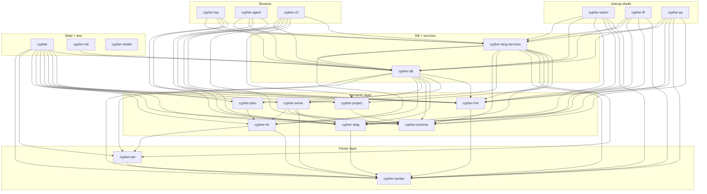

# cyrs architecture

A five-minute orientation. Authoritative pointers live in
[`AGENTS.md`](../AGENTS.md) (§3 crate graph) and the locked spec set under
[`docs/specs/`](./specs/). This file summarises, it does not legislate.

---

## 1. TL;DR

`cyrs` is a standalone Rust front-end for Cypher / GQL: lexer, recovering
parser, lossless CST, typed AST, HIR with name resolution, schema-aware
semantic analysis, diagnostics, formatter, Salsa-based incremental
analysis DB, LSP server, agent JSON API, CLI. It sits below any graph
database: produces a typed logical Plan IR; downstream consumers execute
that Plan against their own storage. No execution, no runtime, no domain
vocabulary.

---

## 2. Crate graph

Nineteen workspace crates, grouped by tier. Arrows are allowed
dependencies per AGENTS.md §3; anything else is forbidden by CI.



| Crate | Purpose | Key external deps |
| --- | --- | --- |
| `cypher-syntax` | Lexer, recovering parser, lossless CST, `SyntaxKind`. | rowan, logos, smol_str, text-size, drop_bomb |
| `cypher-ast` | Typed AST wrappers, codegen'd from `cypher.ungrammar`. | smol_str |
| `cypher-hir` | HIR lowering, name resolution, scope graph, desugar. | indexmap, smol_str |
| `cypher-schema` | `SchemaProvider` trait, label set, `schema.toml` loader. | serde, toml, thiserror |
| `cypher-project` | `cypher-project.toml` manifest, file discovery. | globset, walkdir, toml, serde |
| `cypher-sema` | Schema-free + schema-aware analysis; emits diagnostics. | indexmap, smol_str |
| `cypher-diag` | Stable diagnostic code registry, rendering backends. | codespan-reporting, thiserror, lsp-types (opt) |
| `cypher-plan` | Logical read/write Plan IR; lowered from HIR. | indexmap, serde (opt) |
| `cypher-fmt` | CST-driven, idempotent formatter. | rowan, smol_str |
| `cypher-db` | Salsa-backed incremental analysis database. | salsa, tracing |
| `cypher-lang-services` | Shared completion / hover / rewrite / workspace-nav engines. | rowan, smol_str |
| `cypher-lsp` | LSP binary (native stdio + `web-lsp` feature). | lsp-server, lsp-types, wasm-bindgen (feat) |
| `cypher-agent` | JSON-over-stdio agent API binary. | serde_json, tracing |
| `cypher-cli` | `cypher {parse,check,fmt,plan,explain,schema,project,index}`. | clap, scip, protobuf |
| `cypher-tck` | openCypher TCK v1 harness. | (dev-only corpus) |
| `cypher-testkit` | Shared fixtures + compiletest runner (dev-only, unpublished). | — |
| `cypher` | Meta-crate; feature-gated re-exports of every library crate. | — |
| `cypher-wasm` | `wasm-bindgen` adapter over the agent op surface. | wasm-bindgen, serde-wasm-bindgen |
| `cypher-ffi` | C ABI (`cdylib` + `staticlib`) + cbindgen header. | — |
| `cypher-py` | PyO3 + maturin wheel (abi3-py310). | pyo3 |

---

## 3. The six layers

### 3.1 Lex + parse — `cypher-syntax`

Bytes in, `Parse` out. Recovering: one bad token does not cascade. The
CST is lossless — every byte, trivia included, lives under a
`SyntaxNode`. Recovery invariants: the tree spans the entire input,
every token appears exactly once, any unexpected token becomes an
`ERROR` node or is attached to the nearest sensible parent.

Stability: `SyntaxKind` variants are SemVer (gated by
`cargo-semver-checks`). Lexer internals and recovery heuristics are not.

```rust
use cypher_syntax::parse;

let parse = parse("MATCH (n:Person) RETURN n.name");
assert!(parse.errors().is_empty());
let cst = parse.syntax_node();
```

### 3.2 Typed AST — `cypher-ast`

Zero hand-written accessors. `src/generated.rs` falls out of
`cypher.ungrammar` via `cargo xtask codegen`. AST nodes are thin
`SyntaxNode` wrappers with `cast` constructors — no allocation, no
owned text.

Stability: the grammar file is the contract; regenerated code is
derived. Node shapes move in lockstep with `cypher-syntax`.

```rust
use cypher_ast::Statement;
use cypher_syntax::parse;

let parse = parse("RETURN 1");
let stmt = Statement::cast(parse.syntax_node()).expect("valid stmt");
```

### 3.3 HIR + resolve — `cypher-hir`

AST to HIR lowering plus name resolution. Scope graph threads `WITH`,
`UNWIND`, aggregation scopes, and pattern bindings. Desugar lives here —
list comprehensions and similar sugar collapse before sema sees them.

Stability: HIR node shape is pre-1.0. See
[`docs/stability.md`](./stability.md) for the 1.0 cutover.

```rust
use cypher_hir::lower_statement;

let hir = lower_statement("MATCH (n) RETURN n");
```

### 3.4 Sema — `cypher-sema`

HIR plus an optional `cypher_schema::SchemaProvider`. Two passes:
schema-free (kind / arity / dialect, `E2xxx`) and schema-aware
(label / property / function resolution, `E3xxx`). Emits diagnostics
through `cypher-diag`; no mutation.

Stability: diagnostic codes are forever-stable (§10). Messages may
reword between minors; consumers match on code, not text.

```rust
use cypher_sema::check_kinds;
check_kinds(&stmt, &mut sink);
```

### 3.5 Plan — `cypher-plan`

HIR to logical Plan IR. Read side: `Match`, `Filter`, `Project`,
`Aggregate`, `OrderBy`, `Limit`. Write side: `Create`, `Merge`, `Set`,
`Remove`, `Delete`. Pattern-to-relational expansion happens here so
plans stay storage-agnostic. Does not execute.

Stability: the most in-flux public surface; expect reshaping through
0.x.

```rust
use cypher_plan::lower_statement;

let plan = lower_statement(&hir_stmt)?;
```

### 3.6 Format — `cypher-fmt`

CST to formatted text. Two non-negotiables: `fmt(fmt(x)) == fmt(x)` and
parser round-trip (`parse(fmt(parse(x)))` equals `parse(x)` modulo
trivia). Both property-tested; a failure is a release blocker.

```rust
use cypher_fmt::format;

let pretty = format("match(n)return n");
```

---

## 4. Incrementality — the Salsa DB (`cypher-db`)

Salsa is what makes the editor feel instant: on every keystroke, the
LSP calls back into the database with a replaced `source_text(FileId)`;
Salsa recomputes only the queries whose inputs actually changed.

Conceptual query graph:

```
source_text(FileId) -> String               #[salsa::input]
    -> parse(FileId) -> Parse               #[salsa::tracked]
        -> hir(FileId) -> Statement         #[salsa::tracked]
            -> diagnostics(FileId) -> Vec<Diagnostic>
            -> plan(FileId) -> PlanStatement
    -> options_digest(FileId) -> u64        #[salsa::tracked]
```

Why no crate above `cypher-db` depends on `salsa`: incrementality is an
*integration* concern. Library crates (`cypher-hir`, `cypher-sema`,
`cypher-plan`) expose pure functions. `cypher-db` glues them into Salsa
queries. The LSP and agent call into `cypher-db`; they never reach past
it to a raw parser. This keeps the library surface trivially testable
and lets alternative drivers (batch CLI, CI runners, embedders) opt out
of Salsa entirely.

---

## 5. Shared engines — `cypher-lang-services`

Both `cypher-lsp` and `cypher-agent` answer the same questions: *what
completions / hover / code actions apply at this cursor?* Those engines
live once, here, as pure functions keyed on `(db, file_id, offset)`:

```rust
pub fn complete(db: &Database, file_id: FileId, offset: TextSize) -> Vec<CompletionItem>;
pub fn hover(db: &Database, file_id: FileId, offset: TextSize) -> Hover;
pub fn rewrite(db: &Database, file_id: FileId, fix_id: FixId) -> RewritePayload;
```

The LSP adapter converts `lsp_types::Position` to a byte offset on the
way in and `RewriteEdit` to `lsp_types::TextEdit` on the way out. The
agent adapter does the same with JSON DTOs. Zero analysis logic in
either binary.

Workspace-level navigation (cy-kkw) adds cross-file primitives —
`build_index`, `find_references`, `goto_definition`, `workspace_symbols`
— consumed today by the LSP and by `cypher index scip` in the CLI, with
no duplicated walk.

---

## 6. Interop surfaces (thin adapters)

- `cypher-wasm` — `wasm-bindgen` over the agent op surface; drives the
  Monaco demo at [`demo/web/`](../demo/web/).
- `cypher-ffi` — stable C ABI, cbindgen header at
  [`crates/cypher-ffi/include/cypher.h`](../crates/cypher-ffi/include/cypher.h);
  consumed by Go, Java (JNI), Node N-API, Swift.
- `cypher-py` — PyO3 + maturin, abi3-py310 wheel covers 3.10–3.13.
- `cypher-lsp` `web-lsp` feature — same server, `postMessage` transport
  under `wasm32-unknown-unknown`.
- [`tree-sitter-cypher/`](../tree-sitter-cypher/) — parallel grammar for
  editor highlighting; parity enforced by `cargo xtask tree-sitter-parity`.

---

## 7. Hard invariants

Rules CI enforces. Violating any is a blocking bug even when tests pass.

- **No execution, no storage.** Consumers own that end (spec §1.3 N1,
  §12.5).
- **No domain vocabulary.** CI greps all `.rs` source for `Actor`,
  `Event`, `Operation`, `Capability`, `provenance`, `branch`,
  `bitemporal`, `expertise` (AGENTS.md §2.C2).
- **No overlay crates.** Every crate under `crates/` is either a layer
  from §3 or the meta-crate. Domain extensions live in consumer
  repositories and plug in via `SchemaProvider` (AGENTS.md §2.C3).
- **No `Neo4jCurrent` in v1.** No `CALL { ... }` subqueries, `EXISTS {
  ... }` subqueries, `SHOW`, `CYPHER` prefix directives, APOC, `LOAD
  CSV` (AGENTS.md §9.3, spec §19–20).
- **Stable diagnostic codes.** Once assigned, codes never change meaning
  and are never reused (AGENTS.md §10, spec §10).
- **Gate on every commit.** `cargo xtask gate` runs fmt, clippy with
  `-D warnings`, tests, `cargo deny`, denylist grep, and diagnostic
  registry lint (AGENTS.md §17).
- **`cargo-semver-checks` on public enums** (bead cy-2i9). The
  `SyntaxKind` + diagnostic-code enums are treated as SemVer.
- **No `salsa` above `cypher-db`.** Incrementality is an integration
  concern.
- **`cypher-testkit` is dev-only.** Never re-exported from `cypher`.

---

## 8. Where to go next

- [`AGENTS.md`](../AGENTS.md) — operating manual for contributors (human
  or agent). Re-read at session start.
- [`docs/README.md`](./README.md) — index of specs 0001–0004 and
  supporting docs.
- [`docs/specs/0001-cypher-frontend.md`](./specs/0001-cypher-frontend.md)
  — the locked design doc (twenty-three numbered sections).
- [`docs/stability.md`](./stability.md) — surface-by-surface stability
  contract; 1.0 cutover plan.
- [`docs/release-playbook.md`](./release-playbook.md) — release
  mechanics.
- [`docs/fuzz-runbook.md`](./fuzz-runbook.md) — fuzz target inventory
  and triage.
- [`tree-sitter-cypher/README.md`](../tree-sitter-cypher/README.md) —
  the parallel grammar.
- [`demo/README.md`](../demo/README.md) — Neovim walkthrough, Monaco
  web demo, CLI comparison.
- `docs/getting-started.md`, `docs/performance.md`,
  `docs/diagnostics.md`, `CONTRIBUTING.md` — coming with v0.1.0.
